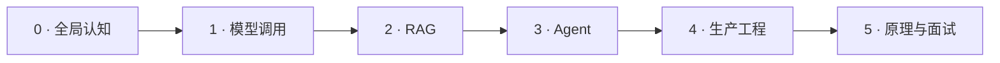

# LLM-Master

> 本仓库资料来自[卡码笔记-大模型专栏](https://notes.kamacoder.com/llm/)。

### 程序员的大模型全栈学习路线

从第一次调用模型 API，到构建可评估的 RAG、可靠的 Agent 与可上线的 AI 系统。

[开始学习](docs/roadmap/README.md) · [全部教程](docs/README.md) · [专题索引](docs/topics/README.md) · [面试题库](docs/interview/llm/README.md)

---

网上从来不缺大模型资料，缺的是一条真正适合程序员的学习路径。

`LLM Master` 不是零散文章的合集，而是一套从**基础认知 → 应用开发 → RAG → Agent → 微调与部署 → Transformer → 项目与面试**逐级展开的完整知识体系。它关心的不只是“这个概念是什么”，更关心：为什么这样设计、工程上如何落地、出了问题怎么排查、面试时如何讲清楚。

如果你有 Java、C++、Go、Python 或前端开发基础，希望进入大模型应用开发、Agent 工程或 AI 后端，这个仓库就是为你准备的。

## 为什么选择 LLM Master

| | 你会得到什么 |
|---|---|
| 🧭 **完整路线** | 从入门到生产与面试，按知识依赖组织，不再面对一堆文章无从下手 |
| 🧱 **工程视角** | 聚焦 API、数据、检索、工具、状态、评估、性能、成本和可靠性 |
| 🔬 **原理与代码** | 从 Q/K/V、Attention 到手写 Tiny Transformer，把黑盒逐层拆开 |
| 🛠️ **项目导向** | 每个阶段都有可交付项目和完成标准，学完能做、能讲、能写进简历 |
| 🎯 **面试闭环** | 覆盖 RAG、Agent、微调、Transformer、AI 编程及真实大厂面经 |
| 🔄 **持续更新** | 跟进 Agent Harness、Context Engineering、MCP、多 Agent 等前沿工程实践 |

## 大模型开发知识全景

| 方向 | 核心内容 | 学习入口 |
|---|---|---|
| AI使用 | ChatGPT、GPT-6 Astra、Claude Opus 5、Fable 5.1| [会员充值教程](https://github.com/youngyangyang04/gpt-daichong)、[API调用教程](https://github.com/youngyangyang04/chatgpt-claude-api) |
| 基础认知 | LLM 关键词、训练流程、岗位选择、Token 与 API 成本 | [开发者入门](docs/roadmap/beginner.md) |
| 模型应用 | Prompt、结构化输出、流式响应、Function Calling、上下文工程 | [应用开发路线](docs/roadmap/application.md) |
| RAG | Chunk、Embedding、向量数据库、混合检索、Rerank、评估 | [RAG 专题](docs/topics/rag.md) |
| Agent | ReAct、工具设计、规划、记忆、状态、失败恢复、评估 | [Agent 路线](docs/roadmap/agent.md) |
| Multi-Agent | Planner/Worker/Reviewer、DAG、任务包、通信与上下文治理 | [Agent 专题](docs/topics/agent.md) |
| 微调 | SFT、RLHF、DPO、LoRA、QLoRA、蒸馏与 RAG 选型 | [微调专题](docs/topics/finetuning.md) |
| 推理与部署 | vLLM、SGLang、KV Cache、PagedAttention、量化、压测 | [部署专题](docs/topics/deployment.md) |
| Transformer | Q/K/V、Attention、位置编码、FFN、LayerNorm、完整实现 | [Transformer 专题](docs/topics/transformer.md) |
| AI 编程 | Claude Code、Agent CLI、Skills、Hooks、MCP、工程工作流 | [AI 编程专题](docs/topics/ai-coding.md) |
| 求职面试 | 高频题、回答框架、项目表达、真实大厂面经 | [面试路线](docs/roadmap/interview.md) |

## 学习路线

### 阶段 0：建立全局认知

先理解大模型应用开发在做什么、不同岗位有什么区别，以及 Prompt、RAG、Agent、微调分别解决什么问题。

- 学习入口：[开发者入门路线](docs/roadmap/beginner.md)
- 完成标志：能画出一次模型请求的完整链路，能解释技术版图和岗位边界

### 阶段 1：掌握模型调用基本功

从“会聊天”走向“会开发”，掌握 Prompt、结构化输出、流式响应、工具调用、上下文、成本和延迟。

- 学习入口：[大模型应用开发路线](docs/roadmap/application.md)
- 阶段项目：实现一个支持流式输出、JSON Schema、错误处理和成本统计的 AI 应用

### 阶段 2：构建可评估的 RAG

打通文档处理、切片、Embedding、召回、Rerank、生成、引用和评估的完整链路。

- 学习入口：[RAG 专题](docs/topics/rag.md)
- 阶段项目：实现一个有混合检索、答案引用、离线评测集和错误分析的知识库

### 阶段 3：从 Workflow 走向 Agent

理解什么时候需要 Agent，掌握工具契约、状态、记忆、规划、权限、失败恢复和评估。

- 学习入口：[Agent 专项路线](docs/roadmap/agent.md)
- 阶段项目：实现一个可中断、可恢复、可追踪、可评估的工具型 Agent

### 阶段 4：补齐生产工程能力

把 Demo 变成可上线服务：部署、缓存、量化、限流、超时、重试、监控、压测和容量规划。

- 学习入口：[部署与性能专题](docs/topics/deployment.md)
- 阶段项目：为 RAG/Agent 服务提交一份压测、容量、可靠性和成本报告

### 阶段 5：理解原理，准备面试

从应用开发者视角理解 Transformer，并把知识、项目与工程取舍整理成有证据的面试表达。

- 学习入口：[Transformer 专题](docs/topics/transformer.md) · [面试路线](docs/roadmap/interview.md)
- 完成标志：能手写最小 Transformer，能围绕指标、故障和取舍讲清项目

> 想直接开始？打开[完整学习路线](docs/roadmap/README.md)，从与你当前水平匹配的阶段进入。

## 四个值得写进简历的项目

| 项目 | 核心能力 | 最低交付标准 |
|---|---|---|
| AI 业务助手 | Prompt、流式输出、结构化结果、Function Calling | 有异常处理、Token 统计和自动化测试 |
| 企业知识库 | 文档解析、混合检索、Rerank、引用、RAG 评估 | 有固定评测集、Bad Case 分类和指标基线 |
| 工具型 Agent | 工具契约、状态机、规划、权限、Checkpoint | 有 Trace、失败恢复、预算上限和完成率评估 |
| 生产级 AI 服务 | 网关、限流、缓存、压测、监控、灰度 | 有 P99、TTFT、TPOT、Goodput 和容量报告 |

项目不以“跑通 Demo”为结束。能够回答**为什么这样选、效果如何度量、失败如何恢复、成本如何控制**，才是真正完成。

## 热门专题

<table>
  <tr>
    <td width="33%" valign="top"><strong>RAG 全链路</strong>  从切片与向量检索，到混合召回、Rerank、引用和评估。  <a href="docs/topics/rag.md">进入专题 →</a></td>
    <td width="33%" valign="top"><strong>Agent 工程</strong>  从 ReAct 与工具调用，到记忆、规划、失败恢复和 Multi-Agent。  <a href="docs/topics/agent.md">进入专题 →</a></td>
    <td width="33%" valign="top"><strong>Transformer</strong>  从 Attention 原理到逐组件手写，真正理解大模型的底层骨架。  <a href="docs/topics/transformer.md">进入专题 →</a></td>
  </tr>
  <tr>
    <td width="33%" valign="top"><strong>微调与对齐</strong>  理解 SFT、RLHF、DPO、LoRA、QLoRA，以及何时不该微调。  <a href="docs/topics/finetuning.md">进入专题 →</a></td>
    <td width="33%" valign="top"><strong>部署与性能</strong>  部署选型、KV Cache、PagedAttention、量化、压测和容量规划。  <a href="docs/topics/deployment.md">进入专题 →</a></td>
    <td width="33%" valign="top"><strong>AI 编程</strong>  Claude Code、Agent CLI、Skills、Hooks、MCP 与工程化开发工作流。  <a href="docs/topics/ai-coding.md">进入专题 →</a></td>
  </tr>
</table>

## 面试与求职

仓库不仅整理知识点，也帮助你把知识变成面试中的有效表达。

- [大模型面经总目录](docs/interview/llm/README.md)
- [Transformer 高频面试题](docs/interview/llm/transformer_interview.md)
- [RAG 高频面试题](docs/interview/llm/rag_interview.md)
- [Agent 高频面试题](docs/interview/llm/agent_interview.md)
- [微调面试详解](docs/interview/llm/finetuning_sft_rlhf_interview.md)
- [Vibe Coding 面试题](docs/interview/llm/vibe_coding_interview.md)
- [字节 Agent 开发四面面经](docs/interview/llm/20260506bytedance.md)

建议用统一结构回答项目题：**业务问题 → 技术选型 → 系统设计 → 评估指标 → 故障与优化 → 最终结果**。

## 如何使用这个仓库

1. **第一次学习**：从[完整学习路线](docs/roadmap/README.md)开始，不建议直接刷全量目录。
2. **正在做项目**：进入对应[专题索引](docs/topics/README.md)，按问题查缺补漏。
3. **准备面试**：先补专题知识，再用[面试路线](docs/roadmap/interview.md)组织回答。
4. **寻找某篇文章**：打开[全部资料索引](docs/README.md)，浏览 150+ 篇教程与面经。

## 适合与不适合

这个仓库适合：

- 有开发基础，希望系统进入大模型应用开发的程序员
- 正在搭建 RAG、Agent、AI 后端或 AI 编程工作流的工程师
- 想补齐原理、生产工程或大模型面试能力的开发者

它不以纯算法研究和大规模预训练为主。如果你的目标是研究新型模型结构、训练基础模型或深入数学证明，建议将本仓库作为应用工程补充，而不是唯一资料。

## 持续更新

大模型领域变化很快，仓库会持续补充新的工程实践、项目经验与面试题。欢迎点击右上角 **Star** 收藏，也可以 **Watch** 获取更新提醒。

最新内容首发于公众号「卡码大模型」。

  

## 参与贡献

发现错别字、断链、技术错误或希望增加的主题，欢迎提交 [Issue](https://github.com/youngyangyang04/llm-master/issues)。如果这个仓库帮助到了你，也欢迎把它分享给正在学习大模型的朋友。

## License

本项目采用 [MIT License](LICENSE)。文章、图片等内容的转载与使用请保留来源，并遵守相应内容的版权说明。

---

**如果你也希望有一条真正面向程序员的大模型学习路线，欢迎 Star 支持。**

[开始学习 →](docs/roadmap/README.md)

